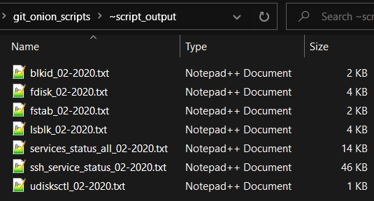

# *Bash Shell Script Samples*

## Example Output:

## Shell Scripting Resources:
* [Bash Cheatsheet](https://devhints.io/bash)
* [TLDP](https://www.tldp.org/LDP/abs/html/)

## Test Files: 
* [ASCII Text](https://onlineasciitools.com/generate-random-ascii)
* [Unicode Text](https://onlineutf8tools.com/generate-random-utf8)
* [Image Data](https://onlinerandomtools.com/generate-random-bitmap)

